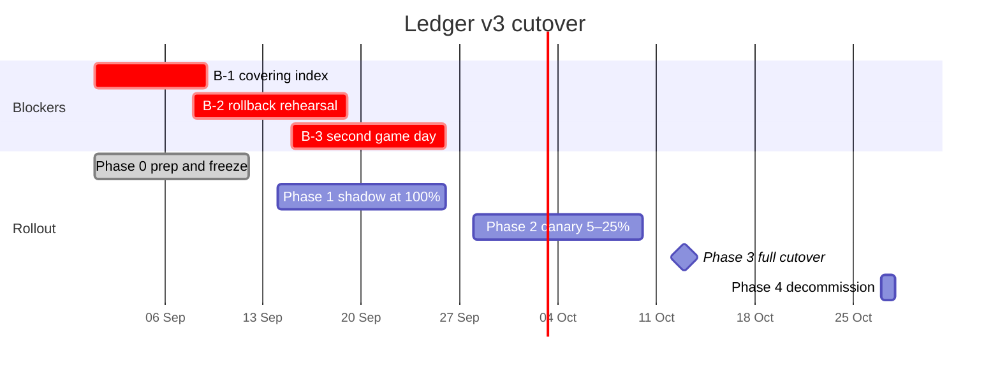

# Ledger Service v3

**Migration Readiness Assessment** · Northwind Payments, Platform Engineering

<table>
<tr><td><strong>Prepared for</strong></td><td>R. Halversen, VP Engineering</td></tr>
<tr><td><strong>Prepared by</strong></td><td>A. Reyes (lead), M. Farouk, J. Lindqvist</td></tr>
<tr><td><strong>Document</strong></td><td>PE-RA-2026-014 · Rev. C · 21 August 2026</td></tr>
<tr><td><strong>Classification</strong></td><td>Internal — Confidential</td></tr>
</table>

> An assessment of whether the v3.0 ledger can safely replace v2.7 in production,
> based on twenty-one days of shadow traffic and a full performance soak.

---

## Contents

1. [Executive summary](#1-executive-summary)
2. [Scope and method](#2-scope-and-method)
3. [Findings](#3-findings)
4. [Cost analysis](#4-cost-analysis)
5. [Risk register](#5-risk-register)
6. [Recommendations](#6-recommendations)
7. [Proposed timeline](#7-proposed-timeline)
8. [Appendix A — Test environment](#appendix-a--test-environment)
9. [Appendix B — Glossary](#appendix-b--glossary)

---

## 1. Executive summary

Ledger Service v3.0 is materially faster than the version it replaces, and twenty-one days of
shadow traffic found no unexplained divergence between the two systems. Posting throughput more
than doubled, reversal latency fell by 57%, and the projected infrastructure bill drops by $3,150
a month even after the worker tier grows.

Three items stand between the current state and a safe cutover. The statement endpoint has
regressed and now misses its latency objective by roughly 50%. The rollback path has been designed
but never rehearsed against the 30-minute recovery objective. And only one of the two required game
days has been run, which leaves half the on-call rotation working from a runbook they have not
exercised.

| Posting throughput | p95, `POST /entries` | Mismatches in 412M | Monthly run cost |
| :---: | :---: | :---: | :---: |
| **+124%** | **37 ms** | **37** | **−5.7%** |

> [!IMPORTANT]
> **Recommendation: conditional go.** Proceed with the October cutover on the condition that all
> three blockers listed in [§6](#6-recommendations) are closed and signed off by 25 September.
> None of them is technically difficult; all of them are schedule risks.

## 2. Scope and method

This assessment covers the ledger service only. It does not cover the reporting warehouse, the
settlement scheduler, or the partner-facing API gateway, all of which have their own migration
tracks.

### 2.1 What was tested

- Functional parity against the v2.7 contract test suite (1,847 cases).
- A 45-minute performance soak per workload, repeated three times per configuration.
- Twenty-one consecutive days of shadow traffic at 100% of production volume.
- A restore drill from the previous night's snapshot into a clean account.
- Two failure injections:
  - primary database failover;
  - a full cache flush at peak.

### 2.2 How the numbers were produced

Every figure in this report is the median of three runs against the build named in
[Appendix A](#appendix-a--test-environment), measured at the load generator rather than inside the
service.[^method] Percentage changes are computed against the v2.7 baseline captured on the same
hardware in the same week, so they are not affected by drift in the underlying instance types.

> We agreed early that a number nobody can reproduce is worse than no number at all. Everything
> here comes with a run identifier and a retained artefact.
>
> — Assessment charter, §2

The soak was driven with the following profile:

```yaml
# k6/profiles/soak.yaml — the profile behind every figure in §3
scenarios:
  posting:
    executor: constant-arrival-rate
    rate: 3200            # requests per second
    duration: 45m
    preAllocatedVUs: 400
  statements:
    executor: ramping-arrival-rate
    startRate: 40
    stages:
      - { target: 120, duration: 10m }
      - { target: 120, duration: 25m }
      - { target: 0,   duration: 10m }
thresholds:
  http_req_duration{scenario:posting}:    ["p(95)<50"]
  http_req_duration{scenario:statements}: ["p(95)<1500"]
```

## 3. Findings

### 3.1 Throughput

Write paths improved substantially; the cached read path improved modestly; the cold read path
regressed.

| Workload | v2.7 baseline | v3.0 candidate | Change |
| :--- | ---: | ---: | ---: |
| Posting, single entry | 1,420 tps | 3,180 tps | **+124%** |
| Posting, batch of 500 | 9,600 tps | 24,100 tps | **+151%** |
| Balance read, cached | 41,000 tps | 44,500 tps | +8.5% |
| Balance read, cold | 2,050 tps | 1,780 tps | **−13%** |
| Reversal | 880 tps | 1,910 tps | **+117%** |

*Table 1 — Sustained throughput by workload, median of three 45-minute soaks.*

The cold-read regression is a direct consequence of the new cache key layout: entries that used to
share a key now occupy separate slots, so a flush costs more to recover from. Pre-warming closes
most of the gap, which is why [R-06](#5-risk-register) is mitigated by a staged rollout rather than
a code change.

### 3.2 Latency against objectives

| Endpoint | v2.7 p95 | v3.0 p95 | Target | Verdict |
| :--- | ---: | ---: | ---: | :--- |
| `POST /entries` | 84 ms | 37 ms | ≤ 50 ms | ✅ Pass |
| `GET /accounts/{id}/balance` | 12 ms | 11 ms | ≤ 25 ms | ✅ Pass |
| `POST /reversals` | 143 ms | 61 ms | ≤ 100 ms | ✅ Pass |
| `GET /statements` (90 d) | 1,910 ms | 2,240 ms | ≤ 1,500 ms | ❌ Fail |

*Table 2 — p95 latency at peak load against the published service level objectives.*

> [!WARNING]
> **Blocker B-1.** `GET /statements` over a 90-day range is 17% slower than v2.7 and misses its
> 1,500 ms objective by 740 ms. The cause is a missing covering index on the new partition scheme,
> confirmed by query plan diff. The fix is queued for 3.0.5 and must land before Phase 2.

### 3.3 Data integrity

Over twenty-one days the shadow run compared 412,380,551 posted entries. Thirty-seven mismatches
were recorded, all of them on foreign-exchange legs carrying six or more decimal places, and all of
them traced to a single rounding path corrected in 3.0.4.[^quarantine] No mismatch was found after
the fix shipped on day 14.

- 37 mismatches in 412,380,551 entries — a rate of $9.0 \times 10^{-8}$.
- All 37 occurred before 3.0.4; zero in the final seven days.
- Maximum absolute divergence: 0.000004 of the minor unit.
- No mismatch affected a settled balance.

<details>
<summary><strong>Why the rounding path was wrong</strong> (click to expand)</summary>

v2.7 rounded once, at the point the entry was persisted. v3.0 moved conversion into the pricing
stage, which rounded to the instrument's display precision before the ledger rounded again to the
minor unit. Two roundings in sequence are not equivalent to one, and the error surfaced only when
the first rounding had six or more decimal places to discard.

3.0.4 removes the intermediate rounding and carries full precision through to the ledger boundary.

</details>

### 3.4 Operational readiness

| Area | Owner | State | Evidence |
| :--- | :--- | :--- | :--- |
| Runbooks rewritten | S. Okafor | ✅ Complete | PE-DOC-311, reviewed 4 Aug |
| Dashboards + alerts | M. Farouk | ✅ Complete | 18 panels, 11 alert rules |
| Rollback rehearsal | A. Reyes | ❌ Not started | Blocker B-2 |
| Game days (2 required) | S. Okafor | ⚠️ 1 of 2 done | Blocker B-3 |
| Backup / restore drill | J. Lindqvist | ✅ Complete | Restored 412M rows in 24 m |
| Capacity headroom ≥ 40% | M. Farouk | ✅ Complete | Measured 61% at peak |

*Table 3 — Readiness checklist as of 21 August 2026.*

## 4. Cost analysis

The API tier shrinks because v3.0 handles more than twice the posting throughput per core. The
worker tier grows because reconciliation now runs continuously rather than nightly.

| Line item | v2.7 / month | v3.0 / month | Change |
| :--- | ---: | ---: | ---: |
| Compute — API tier | $18,400 | $11,900 | −$6,500 |
| Compute — worker tier | $7,250 | $8,900 | +$1,650 |
| Managed PostgreSQL | $22,000 | $22,000 | $0 |
| Redis cache | $3,100 | $4,400 | +$1,300 |
| Object storage and egress | $1,860 | $1,910 | +$50 |
| Observability | $2,400 | $2,750 | +$350 |
| **Total** | **$55,010** | **$51,860** | **−$3,150** |

*Table 4 — Projected monthly infrastructure cost at current production volume.*

One-time migration cost is estimated at 6.5 engineer-weeks, or roughly $41,000 fully loaded.
Against a saving of $3,150 a month the payback period is thirteen months, which sits inside the
eighteen-month threshold the platform group uses for infrastructure work:

$$
T_{\text{payback}} = \frac{41{,}000}{3{,}150} \approx 13.0 \text{ months}
$$

> [!NOTE]
> These projections hold volume constant. Finance currently forecasts 22% transaction growth over
> the next year; at that volume the saving widens to about $4,900 a month because the API tier is
> the component that scales with posting rate.

## 5. Risk register

Score is likelihood (1–5) multiplied by impact (1–5). Anything scoring 12 or above requires a named
owner and a dated mitigation before cutover.[^matrix]

| ID | Risk | Likelihood | Impact | Score | Owner | Mitigation |
| :--- | :--- | :--- | :--- | ---: | :--- | :--- |
| R-01 | Statement endpoint misses its latency SLO | Likely | Moderate | **12** | M. Farouk | Add covering index; ship in 3.0.5 before cutover |
| R-02 | Dual-write drift during the cutover window | Possible | Severe | **15** | A. Reyes | Freeze writes for 90 s, reconcile before opening traffic |
| R-03 | FX rounding defect recurs after 3.0.4 | Unlikely | Severe | 10 | J. Lindqvist | Property-based test in CI across 10⁷ generated cases |
| R-04 | Rollback exceeds the 30-minute RTO | Possible | Severe | **15** | A. Reyes | Rehearse twice; keep v2.7 warm for 14 days |
| R-05 | On-call unfamiliar with the new runbook | Likely | Minor | 8 | S. Okafor | Two game days completed before cutover |
| R-06 | Cold-read regression under cache flush | Possible | Moderate | 9 | M. Farouk | Pre-warm the cache; roll out in 5% stages |

*Table 5 — Open risks at the time of assessment. Two entries score 15 and gate the cutover.*

## 6. Recommendations

In priority order. The first three are the blockers referenced throughout this report.

1. **Ship the covering index in 3.0.5** and re-measure `GET /statements` under the same soak. Do
   not begin Phase 2 until the endpoint is inside its objective.
   *(Blocker B-1, owner M. Farouk, due 8 September.)*
2. **Rehearse the rollback twice** against a production-sized dataset and record the wall-clock
   time. If either rehearsal exceeds 30 minutes, the cutover date moves.
   *(Blocker B-2, owner A. Reyes, due 18 September.)*
3. **Run the second game day** with the half of the rotation that has not yet participated, using
   the rewritten runbook without assistance.
   *(Blocker B-3, owner S. Okafor, due 25 September.)*
4. **Keep the v2.7 fleet warm for fourteen days** after cutover rather than the seven originally
   planned. The incremental cost is about $12,800 and it buys a second full billing cycle of
   confidence.
5. **Add a property-based rounding test** to CI covering ten million generated foreign-exchange
   cases, so the class of defect found in [§3.3](#33-data-integrity) cannot silently return.
6. **Publish the reconciliation dashboard** to the finance team before Phase 2, so that drift is
   visible to the people most likely to notice a wrong number first.

Sign-off gate, to be checked immediately before Phase 3:

- [x] Functional parity suite green
- [x] Shadow run clean for seven consecutive days
- [x] Backup and restore drill completed
- [ ] `GET /statements` inside its objective (B-1)
- [ ] Two rollback rehearsals under 30 minutes (B-2)
- [ ] Both game days completed (B-3)

## 7. Proposed timeline

| Phase | Activity | Window | Exit criterion |
| :--- | :--- | :--- | :--- |
| 0 | Prep, code freeze, index deploy | 1–11 Sep 2026 | 3.0.5 tagged and in staging |
| 1 | Shadow traffic at 100% | 14–25 Sep 2026 | Zero unexplained mismatches for 7 days |
| 2 | Canary 5% → 25% of live traffic | 28 Sep – 9 Oct 2026 | No SLO breach over 10 days |
| 3 | Full cutover | 12–13 Oct 2026 | 100% traffic on v3.0, drift = 0 |
| 4 | Decommission v2.7 | 27 Oct 2026 | Fleet terminated, costs reconciled |

*Table 6 — Phased cutover plan. Each phase has a single, testable exit criterion.*



The plan assumes all three blockers close on schedule. If B-2 slips past 18 September the cutover
moves to the following maintenance window on 26 October; the team should not compress Phase 2,
which exists to catch exactly the kind of slow-burning divergence that a shorter canary would miss.
The full operational procedure is in the
[cutover runbook](https://runbooks.example.com/ledger/v3-cutover), and the risks it hedges against
are listed in [§5](#5-risk-register).

## Appendix A — Test environment

All figures in this report were produced against the following environment. It mirrors production
topology at one-third scale, with identical instance families.

| Component | Specification |
| :--- | :--- |
| Region | eu-central-1, three availability zones |
| API tier | 6 × `c7g.2xlarge` (8 vCPU, 16 GiB) |
| Worker tier | 4 × `c7g.xlarge` (4 vCPU, 8 GiB) |
| Primary database | `db.r7g.4xlarge`, 2 read replicas, 4 TiB gp3 |
| Cache | 3 × `cache.r7g.large`, cluster mode enabled |
| Dataset | 412,380,551 entries across 8,412,077 accounts |
| Load generator | k6 v0.52, 45-minute soak, 12 injector nodes |
| Build under test | `ledger-svc 3.0.4+build.2291` (commit `7f3ac1e`) |

*Table 7 — Test environment specification.*

## Appendix B — Glossary

| Term | Definition |
| :--- | :--- |
| Canary | A deployment that receives a small, deliberately capped share of live traffic before a full rollout. |
| Drift | Any divergence between the records held by the old and new systems while both are being written to. |
| Dual write | Writing each transaction to both v2.7 and v3.0 so the two can be compared entry by entry. |
| p95 | The value below which 95% of measurements fall; the tail that most users actually notice. |
| RPO | Recovery point objective — the maximum data loss, expressed as a period of time, that is tolerable. |
| RTO | Recovery time objective — the maximum tolerable time to restore service after a failure. |
| Shadow traffic | A copy of live requests replayed against the new system whose responses are discarded. |
| SLO | Service level objective — an internal target for a measurable aspect of service quality. |

*Table 8 — Terms used in this report.*

---

<sub>Sample document. Demonstrates YAML front matter, an anchored table of contents, multi-level
headings, GitHub alert callouts, tables with column alignment and emphasis, fenced code in YAML,
a Mermaid Gantt chart, LaTeX math, task lists, nested and ordered lists, a collapsible section,
inline HTML, footnotes and horizontal rules. All names, figures and findings are invented.</sub>

[^method]: Raw results, including per-run variance, are retained in the performance archive under
    run identifiers `RA-2026-014-01` through `-09`.

[^quarantine]: The count excludes 1,204 records quarantined by the pre-existing foreign-exchange
    cutoff job, which behaves identically in both versions.

[^matrix]: Scoring follows the platform group's standard risk matrix, `PE-STD-004`.
